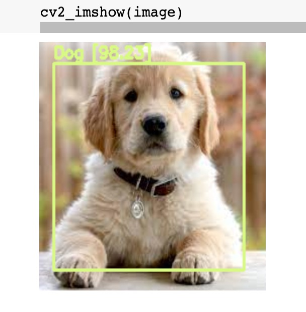

## YOLOv4 Object Detection on Webcam

### 0. Yolov4 model introduction

### 1.Basic tools or cloud introduction
#### 1.1 Github introduction
In this guideline, we are going to use GitHub which is a tool to help Internet hosting for software development and version control using Git. You could
see its details by clicking the [Link](https://en.wikipedia.org/wiki/GitHub)
#### 1.2 Github Basic Operation

* git add 
Puts current working files into the stage. 
* git clone 
Clone an existing repository into a new directory.  
* git commit 
Commits staged changes to a local branch. 
* git pull 
Fetches remote changes on the current branch into the local clone, and merges them into the current working files. 
* git push 
Uploads changes from all local branches to the respective remote repositories. 

Even though we are not going to utilize other GitHub basic operation, you could learn more operations by the [Link](https://confluence.lsstcorp.org/display/LDMDG/Basic+Git+Operations) 

#### 1.2 Google drive and Google colab introduction
[Google drive](https://en.wikipedia.org/wiki/Google_Drive) is a great cloud file storage. Here we need to create google colab on Google drive to prepare for subsequent model establishment and object detections using Yolov4 model,etc. 

Google colab is an interactive environment which could allow you write and execute code. 

Here the website would provide the [video](https://www.youtube.com/watch?v=xoo4mTujM1U) to introduce how we could create a new google colab on Google drive. 

### 2. Obtaining data
If we want to train Yolov4 model to do object detection, the first thing is to obtain trained dataset. Because if we want to train any single object on model, we might need hundreds of availabe format's images. We could download the images from Google Open Images dataset V6 including about 9M images which have object bounding boxes, object segmentation masks, visual connections, and so on. In order to download these images from Google Open Images and convert them into available format image for model training, there is a [video](https://www.youtube.com/watch?v=_4A9inxGqRM) that could help us obtain available data step by step. You might need to use the [GitHub reportory](https://github.com/theAIGuysCode/OIDv4_ToolKit) if you are planning to do every step within that video.

### 3. Training data to obtain model weight
Before you do this step, you should download all file within the [link](https://drive.google.com/drive/folders/1i4j39fyD5GPjxqU-fFCVULl1qNbcuFdw?usp=sharing). After you download all files, you could open google drive and upload YOLOv4_Training_code.ipynb file into google drive. Then you are going to upload dataset and configuration files into relative address paths. Finally, you would obtain model weight after training dataset on darknet framework. 

Term definitions: 
Model weight: Model weights are all the parameters of the model which are in turn all the parameters used in the layers of the model.  
Darknet: Darknet is an open source neural network framework written in CUDA and C. It is fast to install and supports CPU and GPU computations. 

In order to repeat what I did in training data to obtain model weight, you could see the [video](https://youtu.be/jEx9t8DKbvY) 

### 4. Testing data on Yolov4 model

If you could not successfully train your own model weight, you could use my yolov4-obj_last_1800.weights file which could be used to detect humans and dogs. 

You should upload yolov4_object_detection_webcam_images.ipynb file into google drive and open it. Then you could repeat what I did in YOLOv4 object detection on webcam by watching the [video](https://www.youtube.com/watch?v=axQLqrzIR8M) 

### Support or Contact

Having trouble with Pages? Check out our [documentation](https://docs.github.com/categories/github-pages-basics/) or [contact support](https://support.github.com/contact) and we’ll help you sort it out.
